 # CREATE AN  ACCOUNT IN AWS SET UP A ROOT USER AND AN IAM USER 

## AIM :
To create an AWS account, set up a root user, and create an IAM user with specified permissions.

## PROBLEM STATEMENT :
This experiment involves creating an AWS account, configuring security settings for the root user, and setting up an IAM user. IAM users allow for secure, managed access to AWS resources without exposing the main account's root credentials.

## ALGORITHM :

 #### Step 1:
 Create an AWS Account  
 #### Step 2:
 Log In as Root User  
 #### Step 3:
 Open IAM Management Console 
 #### Step 4:
 Add a New IAM User 
 #### Step 5:
 Configure IAM User Login 
 #### Step 6:
 Set Permissions for IAM User 
 #### Step 7:
 Review and Create IAM User 

### REG NO : 212223240072
### NAME   : Kishor Kumar B.
  

  
## OUTPUT

### ROOT USER:
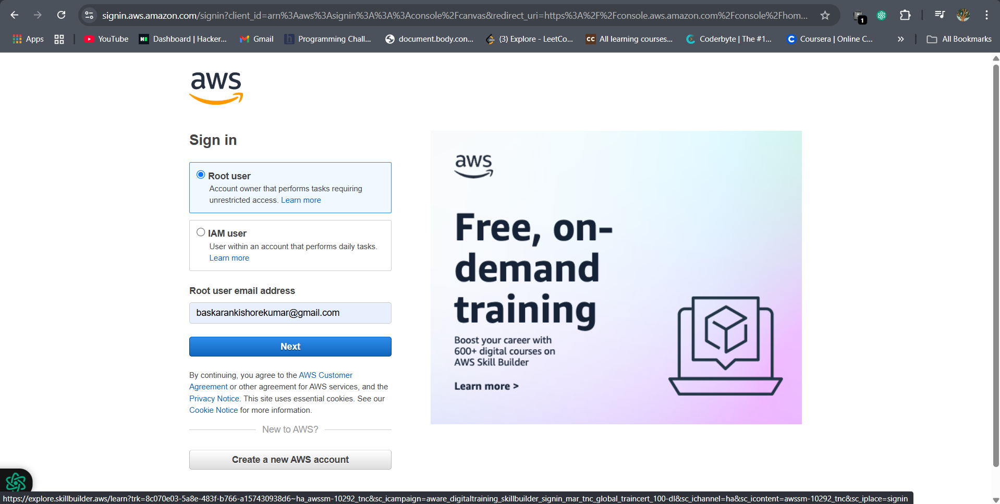

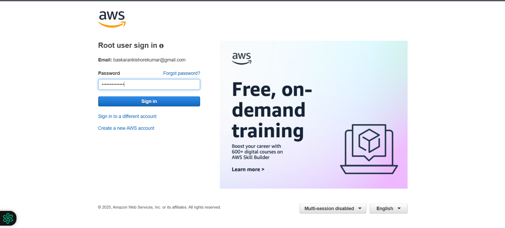
#### Add security protection if needed.(Optional)
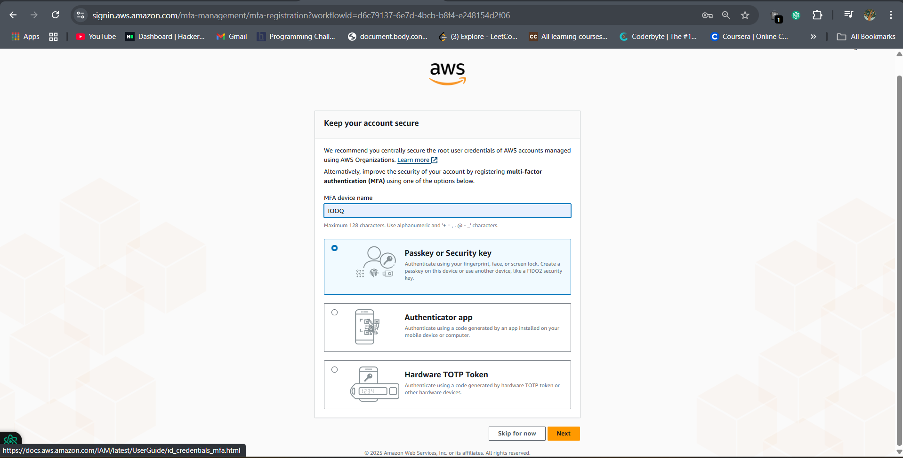
#### This is root user
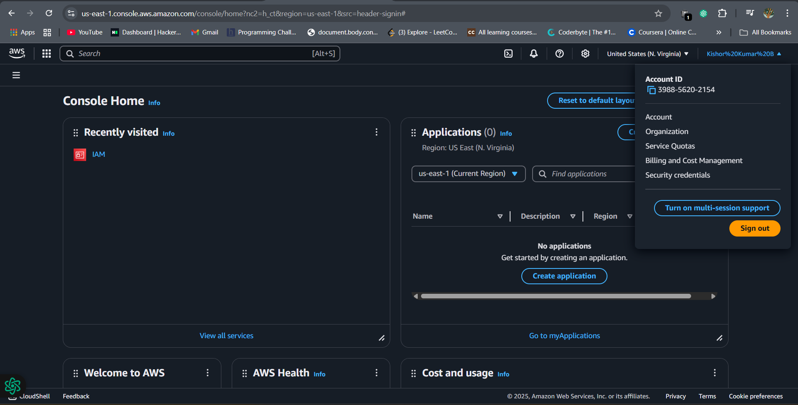

### IAM USER:
### Steps to create a new User
#### 1. Click on the IAM section to create a new user

#### 2. Click on users to create a new user.
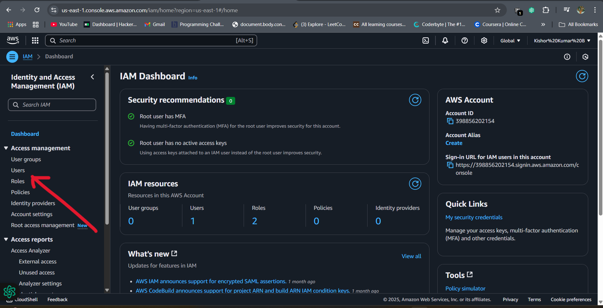
#### 3. Click on Create New user.
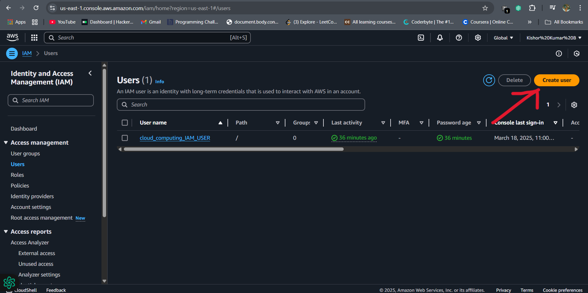
#### 4. Click Next.
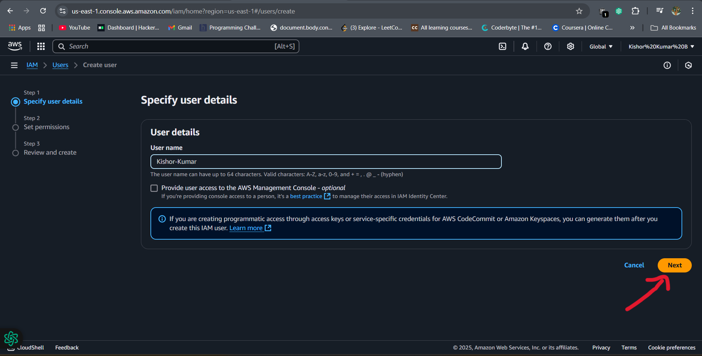
#### 5. Select the first option
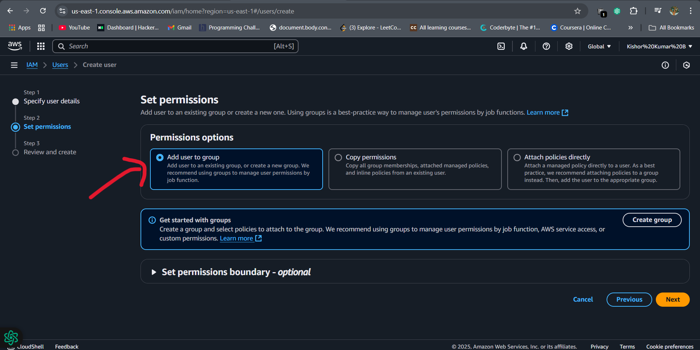
#### 6. Create New User
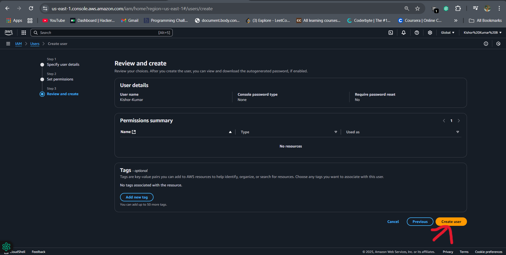
#### 7. Now the user is Created and we Have to set permissions 
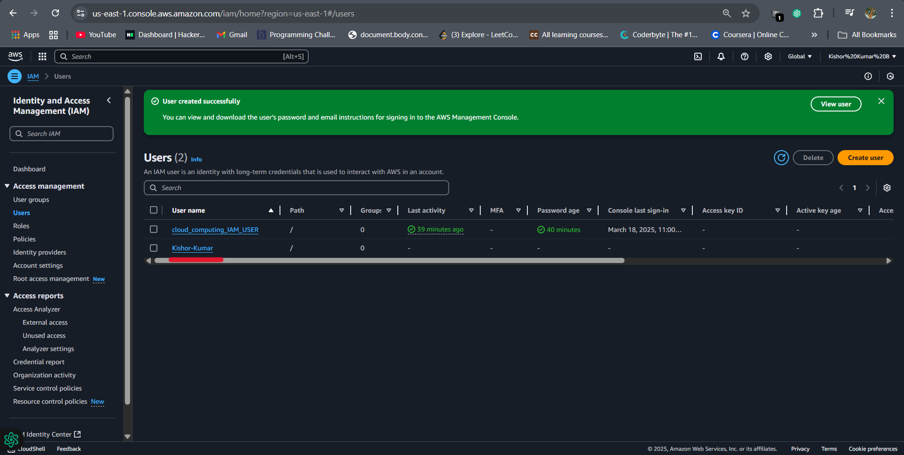
#### 8. Click on security Credientials
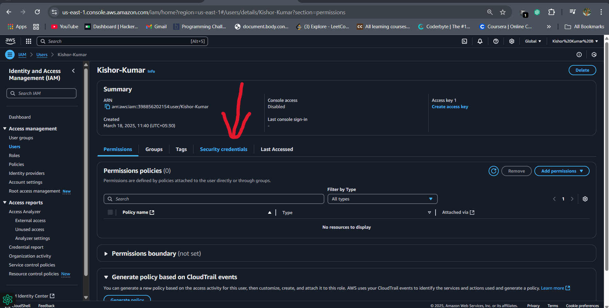
#### 9. Click on enable Console
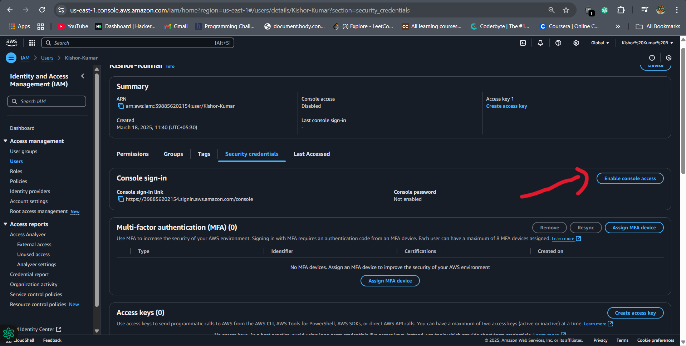
#### 10. Create a password and copy the url for ur user account 
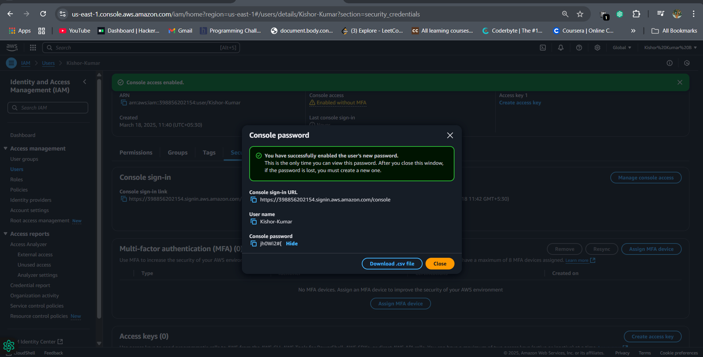
#### 11. paste the url on new tab and  Give the login credentials
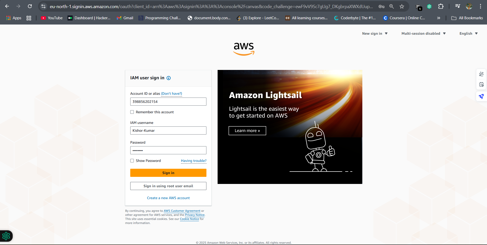
#### 12. This is the new user Home page
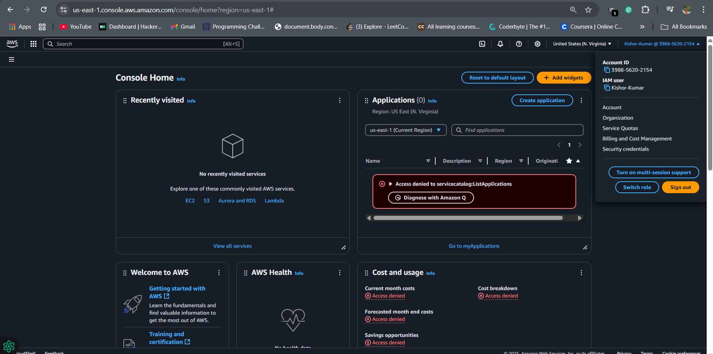
## RESULT
The AWS account was successfully created, with set up for the root user . Additionally, an IAM user was created with specified permissions, allowing for secure, controlled access to AWS resources without the use of the root account. 

  

